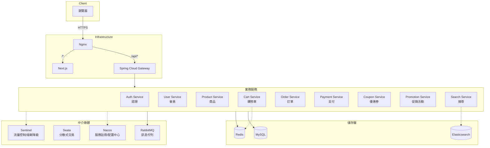
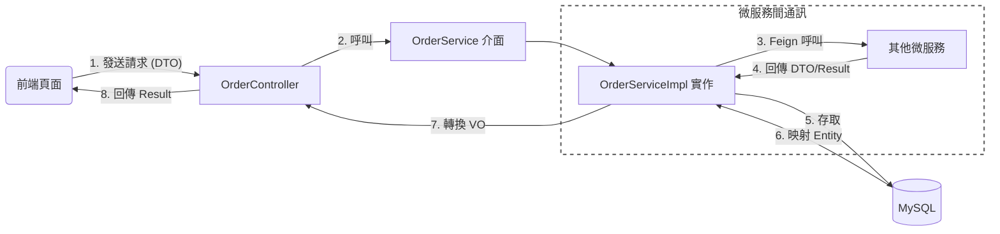
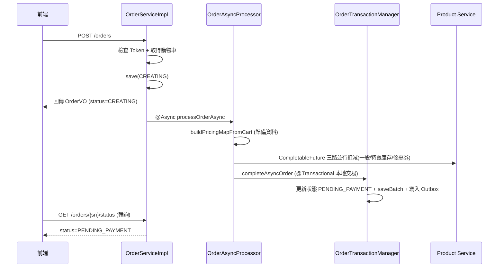

# Nameless Mall v1.0

基於 Spring Cloud Alibaba + Next.js 的微服務選品商城。

- **線上 Demo**：https://isaliveqwq.me

- **前端 Repo**：https://github.com/IsAliveQwQ/Nameless-Mall-Frontend.git

## Screenshots

- **各頁面 UI 預覽圖**：[點擊瀏覽](screenshots)

## 技術堆疊

**後端框架**
- Java 17 / Spring Boot 3.3.4
- Spring Cloud 2023.0.3
- MyBatis-Plus 3.5.7

**微服務元件**
- Spring Cloud Alibaba 2022.0.0.0
- Nacos 2.3.0 (服務註冊與配置中心)
- Spring Cloud Gateway (API 閘道、負載平衡)
- Seata 1.7.0 (分散式交易)
- Sentinel 1.8.6 (流量控制、熔斷降級)
- OpenFeign (服務內通訊)

**資料庫與搜尋引擎**
- MySQL 8.4.0 
- Redis 7.x (Alpine)
- Elasticsearch 8.13.4 

**Middleware**
- RabbitMQ 3.13 (訊息佇列)
- Nginx (反向代理)

**DevOps**
- Docker Compose (容器化編排)
- GitHub Actions (自動化建置)

## 系統架構



## 目錄結構

```
nameless-mall/
├── common/
│   └── common-core/            # 共用模組（Result封裝、全域例外處理、Enum定義）
├── gateway/                    # API Gateway
├── services/
│   ├── auth-service/           # 驗證服務（JWT、OAuth2）
│   ├── auth-api/
│   ├── user-service/           # 會員服務
│   ├── user-api/
│   ├── product-service/        # 商品服務
│   ├── product-api/
│   ├── cart-service/           # 購物車服務
│   ├── cart-api/
│   ├── order-service/          # 訂單服務
│   ├── order-api/
│   ├── payment-service/        # 支付服務
│   ├── payment-api/
│   ├── coupon-service/         # 優惠券服務
│   ├── coupon-api/
│   ├── promotion-service/      # 促銷活動服務
│   ├── promotion-api/
│   ├── search-service/         # 搜尋服務（Elasticsearch）
│   └── search-api/
├── nacos-config/               # Nacos 配置檔
├── sql/                        # 資料庫 Schema 腳本
├── scripts/                    # 維運腳本（Nacos 推送、部署輔助）
├── nginx/                      # Nginx 配置
├── elasticsearch/              # Elasticsearch 初始化配置
├── .github/                    # GitHub Actions CI/CD Workflows
└── docker-compose.yml
```

每個 service 均有對應的 api 以及 service 模組：

- 前者定義了各自的 DTO、VO 和 Feign Client
- 後者則為 Entity 以及業務邏輯實作

## 統一回應格式

所有 API 皆使用 `Result<T>` 封裝：

**成功回應 (HTTP 200)**
```json
{
  "code": "OK",
  "message": "成功",
  "data": { ... }
}
```

**錯誤回應 (HTTP 4xx/5xx)**
```json
{
  "code": "PRODUCT_NOT_FOUND",
  "message": "商品不存在",
  "data": null
}
```

- `code`: 對應語意的錯誤碼
- `message`: 詳細訊息
- `data`: 回應資料，失敗時為 `null`

HTTP 狀態碼由 `GlobalExceptionHandler` 自動映射，若未拋出 `BusinessException`，Spring MVC 預設回傳 200。

錯誤碼定義位置： `ResultCodeEnum.java`

部分範例：

| code | HTTP Status | 說明 |
|------|-------------|------|
| `OK` | 200 | 成功 |
| `INVALID_ARGUMENT` | 400 | 參數無效 |
| `UNAUTHORIZED` | 401 | 未登入或 Token 失效 |
| `PRODUCT_NOT_FOUND` | 404 | 商品不存在 |
| `STOCK_INSUFFICIENT` | 400 | 庫存不足 |
| `SERVICE_UNAVAILABLE` | 503 | 服務暫時無法使用 |

業務邏輯中遇到錯誤，直接拋出 `BusinessException`：
```java
throw new BusinessException(ResultCodeEnum.PRODUCT_NOT_FOUND);
```

## 全域例外處理

`GlobalExceptionHandler` 會攔截專案內拋出的例外，轉為標準 `Result` 格式：

```java
@RestControllerAdvice
public class GlobalExceptionHandler {

    // 處理業務邏輯例外
    @ExceptionHandler(BusinessException.class)
    public ResponseEntity<Result<?>> handleBusinessException(BusinessException ex) {
        log.warn("【業務例外】code={}, message={}", ex.getCode(), ex.getMessage());
        return new ResponseEntity<>(
            Result.fail(ex.getResultCode(), ex.getMessage()),
            HttpStatus.valueOf(ex.getHttpStatus())
        );
    }

    // 處理參數驗證例外 (@Valid)
    @ExceptionHandler(MethodArgumentNotValidException.class)
    public ResponseEntity<Result<?>> handleValidationException(MethodArgumentNotValidException ex) {
        String message = "參數驗證失敗";
        if (ex.getBindingResult().getFieldError() != null) {
            message = ex.getBindingResult().getFieldError().getDefaultMessage();
        }
        log.warn("【參數校驗】MethodArgumentNotValid: {}", message);
        return new ResponseEntity<>(
            Result.fail(ResultCodeEnum.INVALID_ARGUMENT, message),
            HttpStatus.BAD_REQUEST
        );
    }

    // 處理其他未預期例外
    @ExceptionHandler(Exception.class)
    public ResponseEntity<Result<?>> handleGlobalException(Exception ex) {
        log.error("【未捕獲系統例外】...", ex);
        return new ResponseEntity<>(
            Result.fail(ResultCodeEnum.INTERNAL_ERROR, "系統發生錯誤，請稍後重試"),
            HttpStatus.INTERNAL_SERVER_ERROR
        );
    }
}
```

## 資料傳輸模式



**物件職責劃分**：
- **DTO (Data Transfer Object)**: 負責接收前端參數或跨服務傳輸的資料載體。
- **Entity (PO)**: 對應資料庫表格的持久化物件。
- **VO (View Object)**: 專門回傳給前端呈現用的物件。

### 範例：

```java
// Controller：接收 DTO，回傳 VO
@PostMapping
@SentinelResource(value = "submitOrder", blockHandler = "submitOrderBlock")
public Result<OrderVO> submitOrder(@RequestHeader("X-User-Id") Long userId, 
                                   @Valid @RequestBody OrderSubmitDTO submitDTO) {
    OrderVO order = orderService.submitOrder(userId, submitDTO);
    return Result.ok(order, "訂單建立成功");
}

// Service：同步建立訂單骨架，防重複下單，並觸發非同步處理
@Override
public OrderVO submitOrder(Long userId, OrderSubmitDTO submitDTO) {
    String orderSn = UUID.randomUUID().toString().replace("-", "");
    verifyOrderToken(userId, submitDTO.getOrderToken());
    List<CartItemDTO> cartItems = fetchCheckedCartItems(submitDTO.getCartItemIds());

    // 防重複下單：5 分鐘內有 CREATING 訂單則復用
    Order existingCreating = ... // 省略查詢邏輯
    if (existingCreating != null) return buildOrderVO(existingCreating);

    Order order = buildOrder(userId, submitDTO, cartItems, orderSn);
    this.save(order);

    // 在獨立執行緒池處理計價與扣庫存，主執行緒快速回傳
    orderAsyncProcessor.processOrderAsync(order.getId(), orderSn, userId, submitDTO, cartItems);

    return buildOrderVO(order);
}
```


## 分散式交易設計

訂單服務採用「非同步 Saga 模式」搭配「Transactional Outbox」，以最終一致性取代強一致性的分散式鎖，解決高併發下的效能瓶頸。

### 1. 下單流程 (Async Saga + Compensation)



**核心代碼實作**：

```java
// OrderAsyncProcessor：在獨立執行緒池中並行處理
@Async("orderAsyncExecutor")
public void processOrderAsync(Long orderId, String orderSn, Long userId,
                              OrderSubmitDTO submitDTO, List<CartItemDTO> cartItems) {
    List<DecreaseStockInputDTO> regularStockList = Collections.emptyList();
    boolean flashSaleDeducted = false;
    try {
        // 1. 同步準備與計算
        Map<Long, ProductPriceResultDTO> pricingMap = buildPricingMapFromCart(cartItems);
        // ... (省略部分本地建構規則)

        // 2. 並行 Feign RPC：coupon 試算 + 特賣扣庫存 + 一般扣庫存
        CompletableFuture<CouponCalculationResult> couponFuture = ...;
        CompletableFuture<Void> flashSaleFuture = CompletableFuture.runAsync(
                () -> orderTransactionManager.deductFlashSaleStock(order, cartItems, pricingMap), feignCallExecutor);
        CompletableFuture<Void> regularStockFuture = (!stockListForLambda.isEmpty())
                ? CompletableFuture.runAsync(() -> deductRegularStock(stockListForLambda), feignCallExecutor)
                : CompletableFuture.completedFuture(null);

        // 等待三路全部完成（任一失敗則整體失敗觸發 catch 補償）
        CompletableFuture.allOf(couponFuture, flashSaleFuture, regularStockFuture).join();

        CouponCalculationResult couponResult = couponFuture.join();
        applyCouponResult(order, couponResult);

        // 3. 本地交易：寫入訂單明細 + Outbox Event
        flashSaleDeducted = true;
        orderTransactionManager.completeAsyncOrder(
                order, orderItems, shipment, cartItems, pricingMap, submitDTO.getUserCouponId());

    } catch (Exception e) {
        // Saga 平行補償機制：回補各路資源 + 標記訂單為 CREATE_FAILED
        compensate(orderId, orderSn, regularStockList, flashSaleDeducted, e);
    }
}

// OrderTransactionManager：確保本地資料原子性
@Transactional(rollbackFor = Exception.class)
public void completeAsyncOrder(Order order, List<OrderItem> orderItems,
                                OrderShipment shipment, ...) {
    order.setStatus(OrderStatus.PENDING_PAYMENT.getCode());
    orderMapper.updateById(order);

    orderItems.forEach(item -> item.setOrderId(order.getId()));
    orderItemService.saveBatch(orderItems);
    orderShipmentService.save(shipment);

    // Transactional Outbox：用 DB 交易保證訊息不遺失
    if (userCouponId != null) reliableMessageService.createCouponUseMessage(userCouponId, orderSn);
    reliableMessageService.createOrderCreatedMessage(order.getId(), productIds);
    reliableMessageService.createOrderDelayMessage(orderSn); // 延遲取消
}
```

系統另配有 `StaleOrderCleanupTask`，每分鐘掃描並處置長期滯留在 `CREATING` 狀態的異常訂單。

### 2. 取消流程 (CAS + 平行補償)

取消訂單時，採用 CAS (Compare-And-Swap) 更新狀態，成功後再平行觸發各服務的補償邏輯。

```java
public void cancelOrderInternal(String orderSn) {
    Order order = findOrderForCancellation(orderSn);
    if (order == null) return;

    // DB 交易：僅更新狀態與寫入 Outbox（避免長交易鎖住 DB）
    boolean updated = cancelOrderDB(order, orderSn);
    if (!updated) return;

    // 交易提交後，透過 CompletableFuture 平行呼叫外部服務進行補償
    CompletableFuture<Void> stockFuture = CompletableFuture.runAsync(
            () -> revertInventory(order, orderSn), feignCallExecutor);
    CompletableFuture<Void> paymentFuture = CompletableFuture.runAsync(
            () -> cancelPaymentRecord(orderSn), feignCallExecutor);
    CompletableFuture<Void> couponFuture = CompletableFuture.runAsync(
            () -> revertCouponIfUsed(order, orderSn), feignCallExecutor);

    // 等待關鍵補償完成
    CompletableFuture.allOf(stockFuture, paymentFuture).join(); 
    try { couponFuture.join(); } catch (Exception e) {} // 優惠券容錯不阻斷
}
```

## 服務降級機制

為避免單點故障導致雪崩，所有 Feign Client 皆配置 `FallbackFactory` 進行降級：

```java
@FeignClient(name = "product-service", fallbackFactory = ProductFeignFallback.class)
public interface ProductFeignClient {
    @GetMapping("/products/internal/variant/{variantId}")
    Result<VariantDTO> getVariantById(@PathVariable("variantId") Long variantId);

    @PostMapping("/products/internal/decrease-stock")
    Result<Void> decreaseStock(@RequestBody List<DecreaseStockInputDTO> dtoList);

    @PostMapping("/products/internal/increase-stock")
    Result<Void> increaseStock(@RequestBody List<DecreaseStockInputDTO> dtoList);
    // ... 其餘端點（批次查詢規格、分類樹、商品清單、商品詳情等）
}

@Component
public class ProductFeignFallback implements FallbackFactory<ProductFeignClient> {
    private static final Logger log = LoggerFactory.getLogger(ProductFeignFallback.class);

    @Override
    public ProductFeignClient create(Throwable cause) {
        return new ProductFeignClient() {
            @Override
            public Result<VariantDTO> getVariantById(Long variantId) {
                log.error("降級 | ProductFeignClient.getVariantById 失敗, variantId: {}, cause: {}",
                        variantId, cause.getMessage(), cause);
                return Result.fail(ResultCodeEnum.SERVICE_UNAVAILABLE, "商品服務暫時不可用，請稍後重試");
            }
            // ... 其餘方法皆同理，記錄異常並回傳 SERVICE_UNAVAILABLE
        };
    }
}
```


## License

MIT
