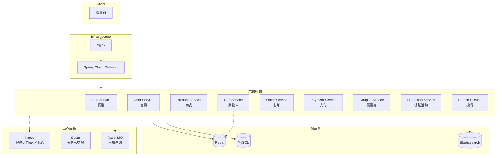
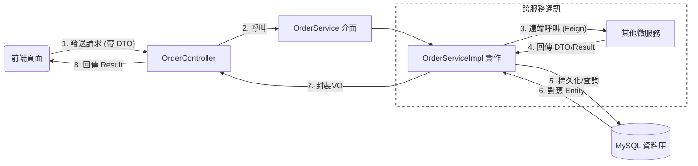
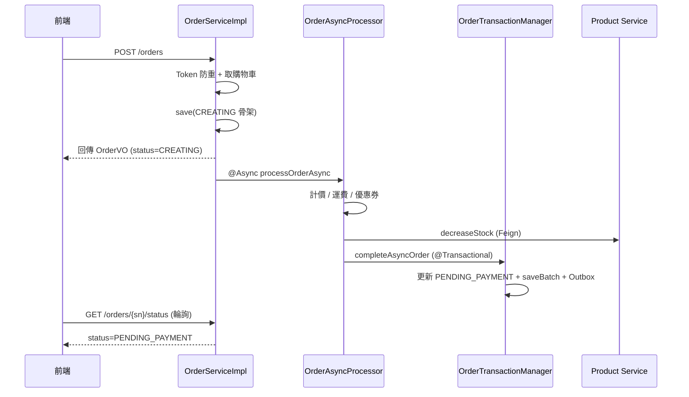

# Nameless Mall v1.0

基於 Spring Cloud Alibaba 微服務商城前台

線上 Demo：https://isaliveqwq.me

前端倉庫：https://github.com/IsAliveQwQ/Nameless-Mall-Frontend.git


## 技術堆疊

**後端框架**
- Java 17 / Spring Boot 3.3.4
- Spring Cloud 2023.0.3 

**微服務元件**
- Spring Cloud Alibaba 2022.0.0.0
- Nacos 2.3.0 (服務註冊 & 配置中心)
- Spring Cloud Gateway (微服務路由、負載均衡)
- Seata 1.7.0 (分散式交易管理)
- Sentinel 1.8.6 (限流 & 降級/熔斷)
- OpenFeign (跨服務遠端呼叫)
- Transactional Outbox (可靠訊息投遞)

**資料庫與搜尋引擎**
- MySQL 8.4.0 
- Redis 7.x (Alpine)
- Elasticsearch 8.13.4 

**ORM**
- MyBatis 3.5.16 / MyBatis-Plus 3.5.7 

**中介元件**
- RabbitMQ 3.13 (訊息佇列)
- Nginx (反向代理)
- Lombok 1.18.32

**自動化部署**
- Docker Compose (容器化部署)
- GitHub Actions (自動化專案建置)

## 系統架構


```mermaid
graph TB
    subgraph Client
        Browser[瀏覽器]
    end

    subgraph Infrastructure
        Nginx[Nginx]
        Gateway[Spring Cloud Gateway]
    end

    subgraph Services[業務服務]
        Auth[Auth Service<br/>認證]
        User[User Service<br/>會員]
        Product[Product Service<br/>商品]
        Cart[Cart Service<br/>購物車]
        Order[Order Service<br/>訂單]
        Payment[Payment Service<br/>支付]
        Coupon[Coupon Service<br/>優惠券]
        Promotion[Promotion Service<br/>促銷活動]
        Search[Search Service<br/>搜尋]
    end

    subgraph Middleware[中介軟體]
        Nacos[Nacos<br/>服務註冊/配置中心]
        Seata[Seata<br/>分散式交易]
        RabbitMQ[RabbitMQ<br/>訊息佇列]
    end

    subgraph Storage[儲存層]
        MySQL[(MySQL)]
        Redis[(Redis)]
        ES[(Elasticsearch)]
    end

    Browser --> Nginx
    Nginx --> Gateway
    Gateway --> Services
    Services --> MySQL
    Services --> Redis
    Cart -.-> Redis
    Search -.-> ES
    Services --> RabbitMQ
    Services -.-> Nacos
```

## 目錄結構

```
nameless-mall/
├── common/
│   └── common-core/            # 共用模組（Result、全域例外處理器、Enum）
├── gateway/                    # 閘道路由
├── services/
│   ├── auth-service/           # 認證（JWT、OAuth2）
│   ├── auth-api/
│   ├── user-service/           # 會員
│   ├── user-api/
│   ├── product-service/        # 商品
│   ├── product-api/
│   ├── cart-service/           # 購物車（Redis）
│   ├── cart-api/
│   ├── order-service/          # 訂單（非同步 Saga + 並行 Feign）
│   ├── order-api/
│   ├── payment-service/        # 支付（綠界、LINE Pay、CAS 狀態機）
│   ├── payment-api/
│   ├── coupon-service/         # 優惠券（三層防競態）
│   ├── coupon-api/
│   ├── promotion-service/      # 促銷活動（Caffeine + Redis Lua）
│   ├── promotion-api/
│   ├── search-service/         # 搜尋（Elasticsearch）
│   └── search-api/
├── nacos-config/               # Nacos 配置檔
├── sql/                        # 資料庫腳本
└── docker-compose.yml
```

每個 service 都有對應的 api 以及 service 模組：

- 前者定義了各自的 DTO、VO 和 Feign Client
- 後者則為 Entity 以及業務邏輯實作

## 統一回應格式

所有 API 回應使用 `Result<T>` 封裝：

成功回應 (HTTP 200)：
```json
{
  "code": "OK",
  "message": "成功",
  "data": { ... }
}
```

錯誤回應 (HTTP 404)：
```json
{
  "code": "PRODUCT_NOT_FOUND",
  "message": "商品不存在",
  "data": null
}
```

- `code`: 對應語意的錯誤碼
- `message`: 詳細訊息
- `data`: 回應資料，失敗時為 `null`

HTTP 狀態碼由 `GlobalExceptionHandler` 根據錯誤碼自動設定，
若未拋出 `BusinessException` 則 Spring MVC 預設回傳 200。

錯誤碼定義位置： `ResultCodeEnum.java`

部分範例：

| code | HTTP Status | 說明 |
|------|-------------|------|
| `OK` | 200 | 成功 |
| `INVALID_ARGUMENT` | 400 | 參數無效 |
| `UNAUTHORIZED` | 401 | 未認證 |
| `PRODUCT_NOT_FOUND` | 404 | 商品不存在 |
| `STOCK_INSUFFICIENT` | 400 | 庫存不足 |
| `SERVICE_UNAVAILABLE` | 503 | 服務暫時不可用 |

業務錯誤透過 `BusinessException` 拋出：

```java
throw new BusinessException(ResultCodeEnum.PRODUCT_NOT_FOUND);
```

## 全域例外處理

`GlobalExceptionHandler` 會統一捕獲所有例外並轉換為 `Result` 格式：

```java
@RestControllerAdvice
public class GlobalExceptionHandler {

    // 業務例外
    @ExceptionHandler(BusinessException.class)
    public ResponseEntity<Result<?>> handleBusinessException(BusinessException ex) {
        return new ResponseEntity<>(
            Result.fail(ex.getResultCode(), ex.getMessage()),
            HttpStatus.valueOf(ex.getHttpStatus())
        );
    }

    // 參數驗證失敗
    @ExceptionHandler(MethodArgumentNotValidException.class)
    public ResponseEntity<Result<?>> handleValidationException(MethodArgumentNotValidException ex) {
        String message = ex.getBindingResult().getFieldErrors().stream()
            .map(FieldError::getDefaultMessage)
            .collect(Collectors.joining(", "));
        return new ResponseEntity<>(
            Result.fail(ResultCodeEnum.INVALID_ARGUMENT, message),
            HttpStatus.BAD_REQUEST
        );
    }

    // 其餘全域例外處理
    @ExceptionHandler(Exception.class)
    public ResponseEntity<Result<?>> handleException(Exception ex) {
        return new ResponseEntity<>(
            Result.fail(ResultCodeEnum.INTERNAL_ERROR),
            HttpStatus.INTERNAL_SERVER_ERROR
        );
    }
}
```

## 資料傳輸模式


```mermaid
graph LR
    User(前端頁面) -- "1. 發送請求 (帶 DTO)" --> OrderController
    OrderController -- "2. 呼叫" --> OrderService[OrderService 介面]
    OrderService --> OrderServiceImpl[OrderServiceImpl 實作]
    
    subgraph Remote [跨服務通訊]
        OrderServiceImpl -- "3. 遠端呼叫 (Feign)" --> OtherServices[其他微服務]
        OtherServices -- "4. 回傳 DTO/Result" --> OrderServiceImpl
    end

    OrderServiceImpl -- "5. 持久化/查詢" --> MySQL[(MySQL 資料庫)]
    MySQL -- "6. 對應 Entity" --> OrderServiceImpl
    
    OrderServiceImpl -- "7. 封裝VO" --> OrderController
    OrderController -- "8. 回傳 Result<OrderVO>" --> User

    style Remote fill:none,stroke:#666,stroke-width:2px,stroke-dasharray: 5 5
```

**物件職責隔離**：
- **DTO (Data Transfer Object)**: 負責接收前端請求或跨服務介面傳輸的資料載體。
- **Entity (PO)**: 直接對應資料庫資料表的持久化實體。
- **VO (View Object)**: 回傳給前端用於顯示的物件。

### 範例：

```java
// Controller：接收 DTO，回傳封裝好的 VO
@PostMapping
public Result<OrderVO> submitOrder(@Valid @RequestBody OrderSubmitDTO submitDTO) {
    return Result.ok(orderService.submitOrder(submitDTO));
}

// Service：同步建立骨架 + 觸發非同步處理
@Override
public OrderVO submitOrder(OrderSubmitDTO submitDTO) {
    verifyOrderToken(submitDTO.getOrderToken());
    List<CartItemDTO> cartItems = fetchCheckedCartItems(submitDTO.getCartItemIds());

    Order order = buildOrder(submitDTO, cartItems, orderSn);
    this.save(order); // CREATING 狀態

    // 觸發非同步處理（庫存扣減、計價、明細寫入）
    orderAsyncProcessor.processOrderAsync(order.getId(), orderSn, userId, submitDTO, cartItems);

    return buildOrderVO(order); // 先回傳，前端輪詢等待結果
}
```


## 分散式交易

訂單服務採用非同步 Saga 模式 + Transactional Outbox，以最終一致性取代分散式交易鎖，降低延遲並提升吞吐量。

### 1. 下單流程 (非同步 Saga + 補償)


```mermaid
sequenceDiagram
    participant C as 前端
    participant S as OrderServiceImpl
    participant A as OrderAsyncProcessor
    participant T as OrderTransactionManager
    participant P as Product Service

    C->>S: POST /orders
    S->>S: Token 防重 + 取購物車
    S->>S: save(CREATING 骨架)
    S-->>C: 回傳 OrderVO (status=CREATING)
    S->>A: @Async processOrderAsync
    A->>A: 計價 / 運費 / 優惠券
    A->>P: decreaseStock (Feign)
    A->>T: completeAsyncOrder (@Transactional)
    T->>T: 更新 PENDING_PAYMENT + saveBatch + Outbox
    C->>S: GET /orders/{sn}/status (輪詢)
    S-->>C: status=PENDING_PAYMENT
```

```java
// OrderServiceImpl：同步建立骨架，觸發非同步處理
public OrderVO submitOrder(OrderSubmitDTO submitDTO) {
    verifyOrderToken(submitDTO.getOrderToken());
    List<CartItemDTO> cartItems = fetchCheckedCartItems(submitDTO.getCartItemIds());

    Order order = buildOrder(submitDTO, cartItems, orderSn);
    this.save(order); // CREATING 狀態

    orderAsyncProcessor.processOrderAsync(
            order.getId(), orderSn, userId, submitDTO, cartItems);

    return buildOrderVO(order);
}

// OrderAsyncProcessor：獨立執行緒池處理核心流程
@Async("orderAsyncExecutor")
public void processOrderAsync(Long orderId, String orderSn, Long userId,
                               OrderSubmitDTO submitDTO, List<CartItemDTO> cartItems) {
    try {
        Map<Long, ProductPriceResultDTO> pricingMap = buildPricingMapFromCart(cartItems);
        recalculateOrderAmounts(order, cartItems);
        calculateShipping(order, submitDTO.getShippingMethod());
        applyCoupon(order, submitDTO, userId);

        // 庫存預扣（Saga 正向步驟，交易外執行）
        orderTransactionManager.deductFlashSaleStock(order, cartItems, pricingMap);
        productFeignClient.decreaseStock(regularStockList);

        // 本地交易：訂單 + 明細 + Outbox
        orderTransactionManager.completeAsyncOrder(order, orderItems, shipment, ...);

    } catch (Exception e) {
        // Saga 補償：歸還庫存 + 標記 CREATE_FAILED
        productFeignClient.increaseStock(regularStockList);
        orderTransactionManager.revertFlashSaleStockIfAny(orderSn);
        orderTransactionManager.markOrderFailed(orderId, extractFailReason(e));
    }
}

// OrderTransactionManager：原子性寫入
@Transactional(rollbackFor = Exception.class)
public void completeAsyncOrder(Order order, List<OrderItem> orderItems,
                                OrderShipment shipment, ...) {
    order.setStatus(OrderStatus.PENDING_PAYMENT.getCode());
    orderMapper.updateById(order);

    orderItems.forEach(item -> item.setOrderId(order.getId()));
    orderItemService.saveBatch(orderItems);
    orderShipmentService.save(shipment);

    // 透過 Outbox：核銷優惠券、通知訂單建立、排程延遲取消
    reliableMessageService.createCouponUseMessage(userCouponId, orderSn);
    reliableMessageService.createOrderDelayMessage(orderSn);
}
```

非同步處理逾時兜底：`StaleOrderCleanupTask` 每分鐘掃描停留在 CREATING 超過 5 分鐘的訂單，標記為 CREATE_FAILED。

### 2. 取消流程 (CAS 狀態防禦 + 交易拆分 + 並行補償)

```java
// cancelOrderInternal：orchestrator（不開交易）
public void cancelOrderInternal(String orderSn) {
    Order order = findOrderForCancellation(orderSn);
    if (order == null) return;

    // DB 交易：CAS 狀態更新 + Outbox（不含 Feign 呼叫，不佔連線池）
    boolean updated = cancelOrderDB(order, orderSn);
    if (!updated) return;

    // 交易外並行 Feign 補償
    CompletableFuture<Void> stockFuture = CompletableFuture.runAsync(
            () -> revertInventory(order, orderSn), feignCallExecutor);
    CompletableFuture<Void> paymentFuture = CompletableFuture.runAsync(
            () -> cancelPaymentRecord(orderSn), feignCallExecutor);
    CompletableFuture<Void> couponFuture = CompletableFuture.runAsync(
            () -> revertCouponIfUsed(order, orderSn), feignCallExecutor);

    CompletableFuture.allOf(stockFuture, paymentFuture).join(); // 關鍵補償需等待完成
    // couponFuture: Best Effort，失敗不阻斷
}

// cancelOrderDB
public boolean cancelOrderDB(Order order, String orderSn) {
    Boolean result = transactionTemplate.execute(status -> {
        boolean updated = this.update(new LambdaUpdateWrapper<Order>()
            .eq(Order::getOrderSn, orderSn)
            .eq(Order::getStatus, OrderStatus.PENDING_PAYMENT.getCode())
            .set(Order::getStatus, OrderStatus.CANCELLED.getCode())
            .set(Order::getUpdatedAt, LocalDateTime.now()));
        if (!updated) return false;

        reliableMessageService.killPendingCouponMessage(orderSn);
        orderMessageProducer.sendOrderCancelled(orderSn);
        return true;
    });
    return Boolean.TRUE.equals(result);
}
```

## 服務降級

所有 Feign Client 都有 FallbackFactory：

```java
@FeignClient(name = "product-service", fallbackFactory = ProductFeignFallback.class)
public interface ProductFeignClient {
    @GetMapping("/products/variants/{id}")
    Result<VariantDTO> getVariantById(@PathVariable Long id);
}

@Component
public class ProductFeignFallback implements FallbackFactory<ProductFeignClient> {
    private static final Logger log = LoggerFactory.getLogger(ProductFeignFallback.class);

    @Override
    public ProductFeignClient create(Throwable cause) {
        return new ProductFeignClient() {
            @Override
            public Result<VariantDTO> getVariantById(Long id) {
                log.error("降級 | ProductFeignClient.getVariantById 失敗, id: {}, cause: {}",
                        id, cause.getMessage(), cause);
                return Result.fail(ResultCodeEnum.SERVICE_UNAVAILABLE, "商品服務暫時不可用");
            }
        };
    }
}
```


## License

MIT
